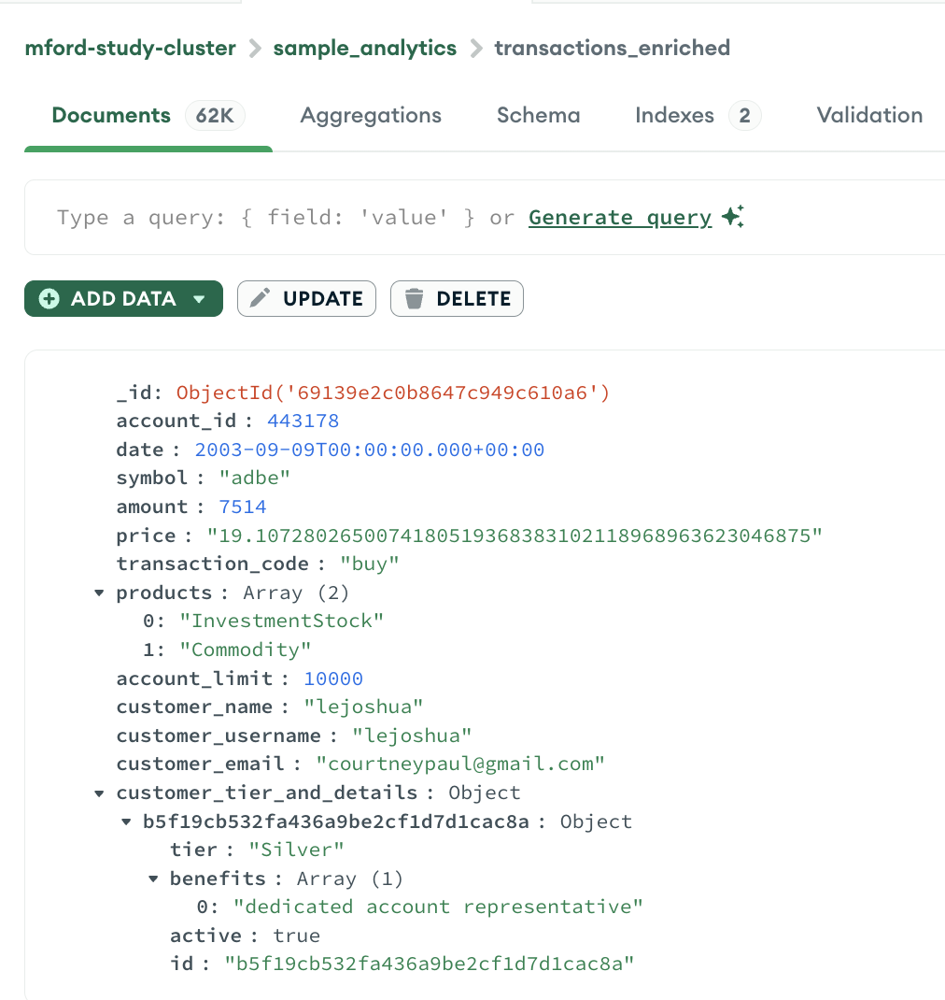
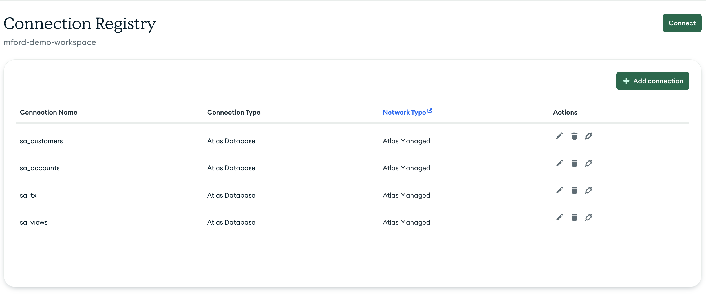
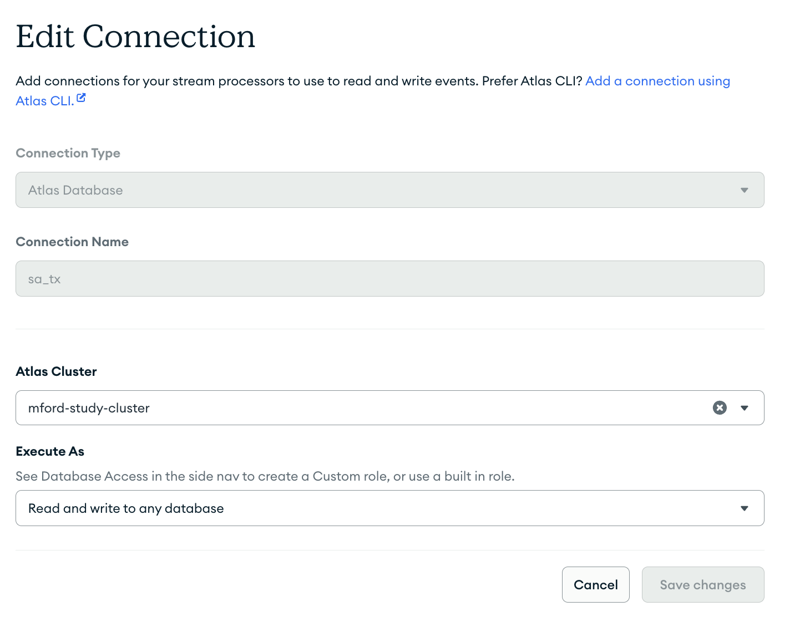
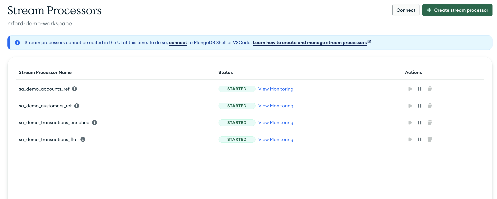

# MongoDB Atlas Materialized Views Demo

This folder contains the configuration and Stream Processor templates used to create **materialized views** in MongoDB Atlas Stream Processing, based on the built-in **Sample Analytics dataset**.

The pipeline demonstrates how to progressively enrich transactional data from multiple collections (customers, accounts, and transactions) into a final view called `transactions_enriched`.

---

## 🔧 Overview

This demo provisions four Atlas Stream Processors using the templates in this folder:

| Processor | Source | Output | Description |
|------------|---------|---------|--------------|
| `customers_ref` | `sample_analytics.customers` | `sample_analytics.customers_ref` | Normalizes customer records and selects key fields. |
| `accounts_ref` | `sample_analytics.accounts` | `sample_analytics.accounts_ref` | Normalizes account records and exposes product and limit details. |
| `transactions_flat` | `sample_analytics.transactions` | `sample_analytics.transactions_flat` | Flattens nested transaction data and prepares it for enrichment. |
| `transactions_enriched` | `transactions_flat` + lookups | `sample_analytics.transactions_enriched` | Joins transactions with customer and account data, adds tier details and product lists. |

---

## 🧩 Data Flow

```
customers_ref -─--┐
                  │
accounts_ref  ─--─┼──▶ transactions_enriched
                  │
transactions_flat ┘
```

Each stage reads from MongoDB sample data collections and writes its output back into the same Atlas cluster (`sample_analytics` database). The result is a progressively enriched materialized view.

---

## 📁 File Structure

```
atlas_materialized_views/
├── templates/
│   ├── customers_ref.j2
│   ├── accounts_ref.j2
│   ├── transactions_flat.j2
│   └── transactions_enriched.j2            ← updated to join customers_ref + accounts_ref
├── processor_details.yml                   ← public-safe config (no credentials)
├── processor_details_local.yml             ← local config (private keys, workspace info)
├── create-sink-colls-indexes.yml           ← Ensures the existence of the materialized view collections and required indexes 
├── create-asp-source-sink-connections.yml  ← creates Atlas Stream Processing connections
├── backfill-analytics-views.yml            ← populates `accounts_ref`, `customers_ref`, and `transactions_enriched` collections with existing sample data
└── deploy-analytics-views.yml              ← deploys stream processors for future transaction data
```

---

## 🚀 Running the Demo

### 1. Prerequisites

- MongoDB Atlas account (Free Tier is fine)
- Access to the **Sample Datasets** (enable in your Atlas cluster under *Collections → Load Sample Dataset*)
- Atlas Programmatic API Keys (use your own keys for local use)
- Ansible and Python 3 installed locally

In particular, this demonstration will utilize the `sample_analytics` database, and its collections:
- `accounts`
- `customers`
- `transactions`

### 2. Configure the Environment

Copy the local configuration template and fill in your Atlas details:

```bash
cp processor_details.yml processor_details_local.yml
```

Then edit `processor_details_local.yml` with your:
- `atlas_group_id` (your Atlas Project ID)
- `atlas_public_key` / `atlas_private_key`
- `atlas_cluster_name` and `atlas_cluster_uri`

### 3. Create the source and sink collections and their corresponding indexes

Run the Ansible playbook to create the source and sink collections, along with the unique indexes required to send materialized view data to them:

```bash
ansible-playbook create-sink-colls-indexes.yml -i localhost
```

### 4. Populate the `accounts_ref`, `customers_ref`, `transactions_flat`, and `transactions_enriched` collections using the existing sample data

Atlas Stream Processing will operate on new, incoming data. For the existing sample data collection, run the same MongoDB Aggregation Pipelines with the following playbook:

```bash
ansible-playbook backfill-analytics-views.yml -i localhost
```

This will give you MongoDB documents with account, `customer`, and `transaction` data, stored altogether, making future queries faster (you can improve search performance further by using indexes).




### 5. Deploy the Stream Processors Connections

Making sure your stream processing workpace created, and specified with with `workspace_name` variable in the `./vars/processor_details_local.yml` file,  Run the Ansible playbook to create all Stream Processor connections:

```bash
ansible-playbook create-asp-source-sink-connections.yml -i localhost
```

This will create all of the connections required to serve as Stream Processor Sources and Sinks in the next step. Your COnnection Registry should look like this:



And closer inspection of the Connections should look like so (they are all the same, just named differently to be easily identifiable for the purpose of this exercise):




### 6. Deploy the Stream Processors

Run the Ansible playbook to create all processors in your Atlas environment:

```bash
ansible-playbook deploy-analytics-views.yml -i localhost
```

This will automatically register and start:
- `customers_ref`
- `accounts_ref`
- `transactions_flat`
- `transactions_enriched`



Each processor runs continuously, maintaining up-to-date materialized views.

---

## 🧠 What the Enriched View Includes

The final `transactions_enriched` collection combines multiple dimensions:

- **Customer Information**: username, name, email, tier_and_details
- **Account Details**: product list, limit values
- **Transaction Metrics**: amount, price, transaction code, date, symbol
- **Derived Tier Detail**: extracted per-account tier from `tier_and_details`

Example document:

```json
{
  "account_id": 443178,
  "date": "2016-06-14T00:00:00Z",
  "symbol": "team",
  "amount": 9240,
  "price": "24.15",
  "transaction_code": "buy",
  "customer_username": "fmmiller",
  "customer_name": "Elizabeth Ray",
  "customer_email": "arroyocolton@gmail.com",
  "tier_detail": {
    "tier": "Platinum",
    "discount": 0.05
  },
  "products": [
    { "type": "Credit Card", "name": "Rewards Plus" },
    { "type": "Loan", "name": "Auto Advantage" }
  ]
}
```

---

## 🧰 Customizing

You can safely edit the `.j2` templates to:
- Change database or collection names.
- Add new derived fields.
- Modify `$project` stages to include/exclude columns.

For example, to add a new calculated field like `transaction_value`:

```js
{ $set: { transaction_value: { $multiply: ["$amount", "$price"] } } }
```

Then re-run the playbook to redeploy updated processors.

---

## 🧹 Cleanup

Use the GUI to delete all processors and connections, clusters, and the stream processing workspace created by this demo (automations to be added at a later date)

---

## 🪶 License

MIT License © 2025 Michael Ford
