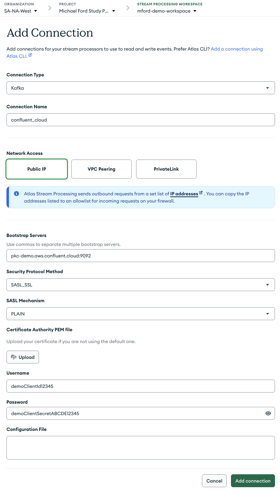
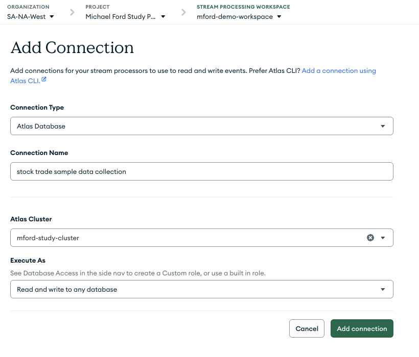
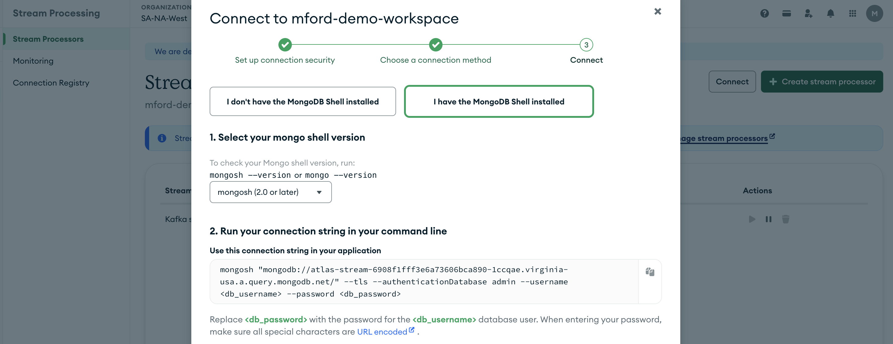
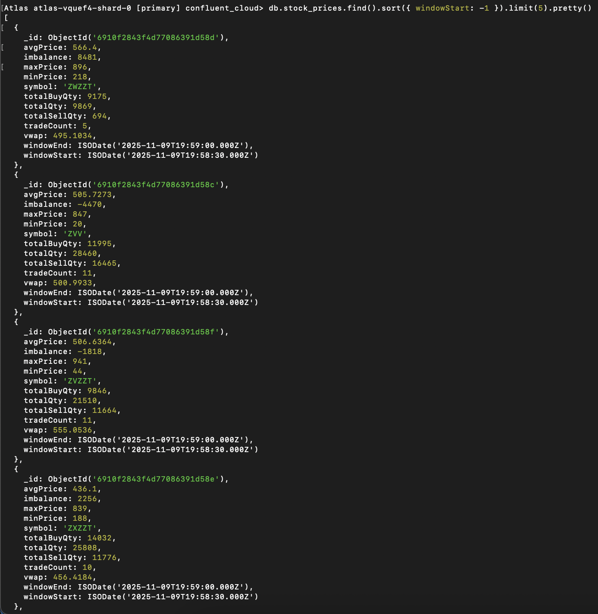

# MongoDB Atlas Stream Processing: Stock Trade Aggregation

This project demonstrates how to build a **real-time stock trade analytics pipeline** using **MongoDB Atlas Stream Processing (ASP)**. It shows how to connect to a **Kafka topic (Confluent Cloud)** streaming live trade data, process it with **tumbling windows**, and output aggregated metrics into a MongoDB collection.

---

## Overview

The workflow consists of:
1. **Kafka Source (Confluent Cloud)** → A topic streaming stock trade data (`sample_data_stock_trades`).
2. **Atlas Stream Processing (ASP)** → A stream processor running a 10-second tumbling window to compute real-time metrics.
3. **Atlas Sink** → A target MongoDB collection (`stock_prices`) where the processed aggregates are stored.

---

## Prerequisites

- A MongoDB Atlas project with Stream Processing enabled
- A Confluent Cloud Kafka cluster
- Access credentials for Confluent (Bootstrap servers, API key/secret)
- MongoDB Atlas CLI or Stream Processing shell (mongosh)
- **Ansible** (to automate connection and processor creation)

---

## 1. Create a Confluent Cloud Kafka Data Source

### Create a Kafka Cluster
- [Create Kafka Cluster](https://docs.confluent.io/cloud/current/clusters/create-cluster.html#create-ak-clusters)
  - **NOTE** A cluster of type `BASIC` will suffice for this project.

### Create a Kafka Topic
- [Create a Kafka Topic in Confluent Cloud GUI](https://docs.confluent.io/cloud/current/topics/overview.html#create-topics)

### Create a Stock Price Source Connector
- [Datagen Source Connector for Confluent Cloud](https://docs.confluent.io/cloud/current/connectors/cc-datagen-source.html)

## 2. Creating the Kafka Connection (GUI)

1. Go to **Atlas → Stream Processing → Connections → Create Connection**.
2. Choose **Kafka** as the connection type.
3. Fill out the required fields:
   - **Bootstrap servers** → Provided by Confluent Cloud
   - **Authentication** → Client ID & Secret
   - **Security protocol** → `SASL_SSL`
   - **Mechanism** → `PLAIN`
4. Name this connection (e.g., `confluent_cloud`).



---

## 2. Creating the MongoDB Atlas Sink Connection (GUI)

Create a second connection to write processed data into MongoDB:

1. Go to **Connections → Create Connection → MongoDB Atlas Cluster**.
2. Select your target cluster and database.
3. Name this connection (e.g., `stock trade sample data collection`).



---

## 3. Automating with Ansible (Connections & Processor)

You can provision everything via Ansible playbooks in this repo.

### A) Create both **ASP Connections** (Kafka + Atlas)
Playbook: `create-asp-connections.yml`

**What it does**
- Loads variables from `./vars/processor_details_local.yml` if present, otherwise from `./vars/processor_details.yml`.
- Calls the Atlas API to **list existing connections**, then **creates only what’s missing** (idempotent).
- Creates:
  - **Kafka connection** (SASL_SSL PLAIN) with bootstrap servers and client credentials.
  - **Atlas cluster connection** for the sink with `readWriteAnyDatabase` role.

**Run**
```bash
ansible-playbook create-asp-connections.yml -i localhost,
```

**Expected variables (in your vars file)**
```yaml
atlas_group_id: "<your-project-id>"
workspace_name: "<your-asp-workspace-name>"
atlas_public_key: "<atlas-public-api-key>"
atlas_private_key: "<atlas-private-api-key>"

kafka_connection_name: "confluent_cloud"
kafka_bootstrap_server: "<pkc-xxxxx.us-west2.gcp.confluent.cloud:9092>"
kafka_client_id: "<confluent-api-key>"
kafka_client_secret: "<confluent-api-secret>"

atlas_db_connection_name: "stock trade sample data collection"
atlas_cluster_name: "<your-atlas-cluster-name>"
```
> The playbook is safe to re-run; it checks for existing connections first.

### B) Create the **Stream Processor**
Playbook: `create-atlas-stream-processor.yml`

**What it does**
- Renders your processor JSON from `templates/stream_processor.j2` → `files/stream_processor_definition.json`.
- Loads the JSON definition and **creates the processor only if it doesn’t exist**.
- Uses the Atlas Streams API endpoint for processor creation.

**Run**
```bash
ansible-playbook create-atlas-stream-processor.yml -i localhost,
```

**Important files**
- `templates/stream_processor.j2` — the Jinja2 template for your processor pipeline.
- `files/stream_processor_definition.json` — the rendered JSON sent to the Atlas API.

> Run the connections playbook **first**, then the processor playbook. Re-running is safe (both are idempotent).

---

## 4. Creating the Stream Processor (Pipeline)

The processor reads from the Kafka topic, groups data by ticker symbol over a 30-second **processing-time** tumbling window, and calculates multiple metrics. It also stamps each window with start/end UTC timestamps.

### Processor Definition

```json
{
  "name": "stock_trade_window_processor",
  "pipeline": [
    {
      "$source": {
        "connectionName": "confluent_cloud",
        "topic": "sample_data_stock_trades"
      }
    },
    {
      "$tumblingWindow": {
        "interval": { "size": 30, "unit": "second" },
        "pipeline": [
          {
            "$group": {
              "_id": {
                "symbol": "$symbol",
                "windowStart": { "$meta": "stream.window.start" },
                "windowEnd":   { "$meta": "stream.window.end" }
              },
              "totalQty":   { "$sum": "$quantity" },
              "avgPrice":   { "$avg": "$price" },
              "vwap_num":   { "$sum": { "$multiply": [ "$price", "$quantity" ] } },
              "vwap_den":   { "$sum": "$quantity" },
              "tradeCount": { "$sum": 1 },
              "totalBuyQty":  { "$sum": { "$cond": [ { "$eq": [ "$side", "BUY" ] },  "$quantity", 0 ] } },
              "totalSellQty": { "$sum": { "$cond": [ { "$eq": [ "$side", "SELL" ] }, "$quantity", 0 ] } },
              "minPrice": { "$min": "$price" },
              "maxPrice": { "$max": "$price" }
            }
          },
          {
            "$project": {
              "_id": 0,
              "symbol": "$_id.symbol",
              "windowStart": "$_id.windowStart",
              "windowEnd": "$_id.windowEnd",
              "windowSecs": {
                "$dateDiff": {
                  "startDate": "$_id.windowStart",
                  "endDate": "$_id.windowEnd",
                  "unit": "second"
                }
              },
              "tradeCount": 1,
              "totalQty": 1,
              "avgPrice": { "$round": [ "$avgPrice", 4 ] },
              "vwap": {
                "$cond": [
                  { "$gt": [ "$vwap_den", 0 ] },
                  { "$round": [ { "$divide": [ "$vwap_num", "$vwap_den" ] }, 4 ] },
                  null
                ]
              },
              "totalBuyQty": 1,
              "totalSellQty": 1,
              "imbalance": { "$subtract": [ "$totalBuyQty", "$totalSellQty" ] },
              "minPrice": 1,
              "maxPrice": 1
            }
          }
        ]
      }
    },
    {
      "$merge": {
        "into": {
          "connectionName": "stock trade sample data collection",
          "db": "confluent_cloud",
          "coll": "stock_prices"
        }
      }
    }
  ]
}
```

### Metrics Produced
Each window emits a document per stock ticker with:
- `symbol` — Stock ticker
- `windowStart` / `windowEnd` — **UTC** timestamps of the 30-second interval
- `tradeCount` — Number of trades processed
- `totalQty` — Total shares traded
- `avgPrice` — Mean trade price
- `vwap` — Volume-weighted average price
- `totalBuyQty` / `totalSellQty` — Buy/sell split
- `imbalance` — Difference between buy and sell volume
- `minPrice` / `maxPrice` — Price extremes within the window

📊 *This enables dashboards and time-series analysis of real-time stock behavior.*

---
## 5. Start the Stream Processor

To make things quick, you can start, stop, and delete your Atlas Stream Processor from the command line. Retrieve the connection string for your Atlas Stream Processing Workpace by going to **Atlas → Stream Processing → Connect** within your specified workspace:



After connecting to your workspace via the CLI, run the following commands to manage your Stream Processor. For example, given the name of the Atlas Stream Processor as `Kafka stock trade processor`:

### Start
` AtlasStreamProcessing> sp["Kafka stock trade processor"].start()`

### Stop
`AtlasStreamProcessing> sp["Kafka stock trade processor"].stop()`

### Delete
`AtlasStreamProcessing> sp["Kafka stock trade processor"].drop()`

## 5. Verifying Output

After the processor is running, check the output collection after connecting to your mongodb database instance:

```js
db.stock_prices.find().sort({ windowStart: -1 }).limit(5).pretty()
```
Where `stock_prices` is the name of the sink collection (yours may be different).

All timestamps are stored in **UTC**. To convert in queries:
```js
{
  "$dateToString": {
    "date": "$windowStart",
    "timezone": "America/Chicago",
    "format": "%Y-%m-%dT%H:%M:%S"
  }
}
```


<!--  -->


---

## References
- [MongoDB Atlas Stream Processing Docs](https://www.mongodb.com/docs/atlas/stream-processing/)
- [Confluent Cloud Kafka Quickstart](https://developer.confluent.io/quickstart/kafka-on-confluent-cloud/)
- [MongoDB Atlas CLI Reference](https://www.mongodb.com/docs/atlas/cli/stable/)

---

**Other things to try:**
- Add a second stream processor for anomaly detection (price spikes, unusual volume)
- Integrate with a dashboard (MongoDB Charts or Grafana)
- Add event-time processing via `tsFieldName` for backtesting historical topics
